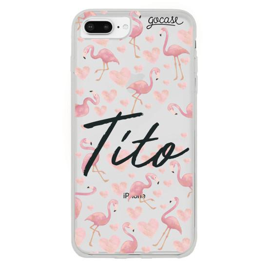
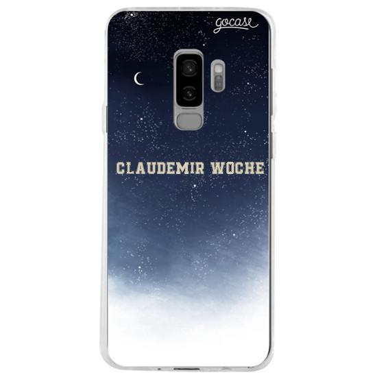
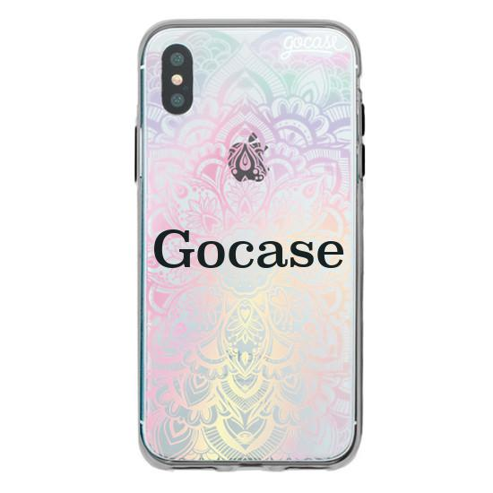

# Desafio - Processamento Digital de Imagens

Script que recebe e customiza a imagem de um produto.

### Pré-requisitos

Bibliotecas [Pillow](https://pillow.readthedocs.io/en/stable/ "Pillow docs") e [NumPy](https://numpy.org/ "Numpy Homepage").

### Como usar

1. Baixe esse repositório
2. Abra um terminal na pasta do repositório
3. Digite no terminal: `python3 gocase.py nome_da_imagem nome_da_fonte texto coordenadas` e aperte enter.

A ordem dos parâmetros é essencial.

O nome das imagens deve ser o mesmo de uma das imagens da pasta *mockups*.

O nome das fontes deve ser o mesmo de uma das fontes da pasta *fonts*.

Se quiser adicionar mais imagens ou fontes, basta adicioná-las nessas pastas.

A imagem customizada será gerada na pasta do repositório com o nome `nome_da_imagem_texto`.

### Exemplos

* Exemplo 1: `python3 gocase.py flamingos mighty-river Tito 180,230`

* Exemplo 2: `python3 gocase.py night-tones be-true-to-your-school Claudemir Woche 170,230` 

* Exemplo 3: `python3 gocase.py mandala superclarendon Gocase 170,255`

### Questões Adicionais

1. A partir de um script obter as coordenadas de onde ficam esses itens na imagem e não permitir que customizações sejam feitas numa região dessas coordenadas.

2. Feature já implementada.

3. 
